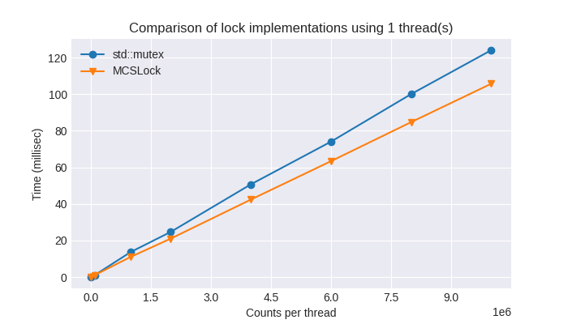
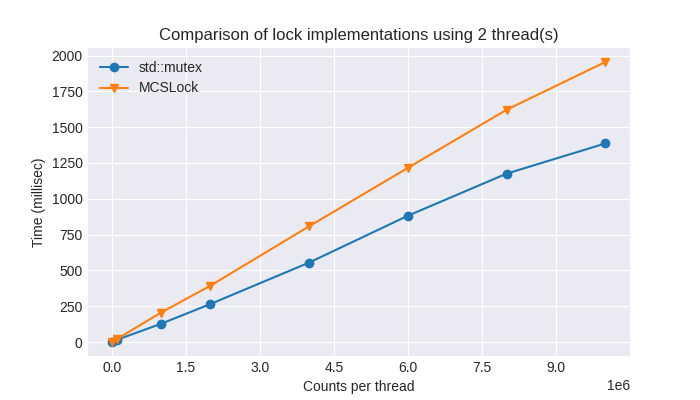
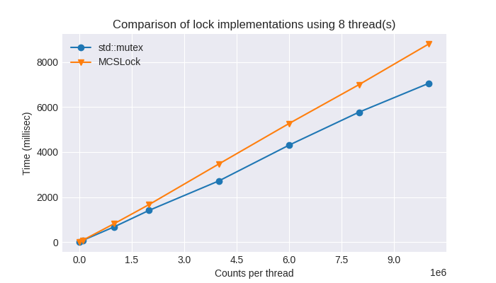
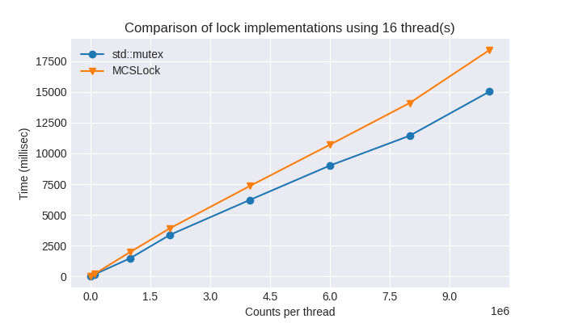

# MCSLock implementation

MCSLock is a queue based lock implementation.
This implementation is based on the following materials.

- http://www.scs.stanford.edu/14wi-cs140/notes/synchronization-print.pdf
- https://mfukar.github.io/2017/09/26/mcs.html
- https://stackoverflow.com/questions/61944469/problems-with-mcs-lock-implementation

# Build

```
g++ main.cpp mcs_lock.cpp -lpthread -Ofast
```

# Performance

Benchmarking is done by incrementing a shared counter using `8 core Intel(R) Core(TM) i9-9900 CPU @ 3.10GHz with 32GB RAM`, 2 threads per core.

```
$ g++ --version
g++ (Ubuntu 11.1.0-1ubuntu1~20.04) 11.1.0
```

`std::mutex` seems to win most of the time except for single threaded execution.






The graph can be obtained by executing `run_experiment.py`.